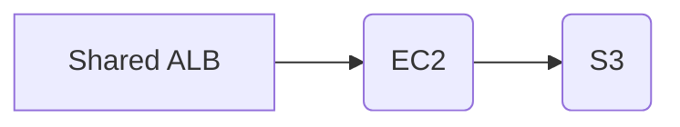

# @guardian/actions-static-site V2

Action to provision and serve a static site with Google Auth and a custom
domain.

Behind the scenes the action outputs Cloudformation and RiffRaff configuration
for your project. The marginal cost of a site is minimal - just the storage of
your files in S3 and data transfer costs - as the core infrastructure is shared.

**Note: your domain must be registered with the Google project for the Google
auth callback to work - ping it on the `DevX Stream` channel and we can quickly
add this for you.**

```yaml
name: example
on:
  pull_request:
  workflow_dispatch:
  push:
    branches:
      - main
jobs:
  example:
    runs-on: ubuntu-latest

    # Required for Riffraff upload (which writes to AWS)
    permissions:
      id-token: write
      contents: read

    steps:
      - uses: actions/checkout@v2
      - uses: actions/setup-node@v3
        with:
          node-version-file: '.nvmrc'
          cache: npm

      # ... (Buiild your static site.)

      # Then upload it as an artifact
      - uses: actions/upload-artifact@v3
        with:
          path: my-site

      # Then invoke this action (replacing app and domain)
      - uses: guardian/actions-static-site@v2
        with:
          app: devx-docs
          domain: devx.gutools.co.uk
          guActionsRiffRaffRoleArn: ${{ secrets.GU_RIFF_RAFF_ROLE_ARN }}
```

## Inputs

### **domain** `string` (required):

The domain should be a Guardian-owned domain. For internal tools,
`[app].gutools.co.uk` is recommended but check it is free first!

### **artifact** `string` (optional - default='artifact')

Name of the artifact containing the static resources. Should be uploaded in
an earlier workflow step.

## Architecture



A shared ALB is used for all static site instances. The action uploads your
files to the shared S3 bucket with your domain as the key prefix on files, and
also creates a CNAME record and cert, and connects those to the ALB.

The EC2 instance checks the auth token and serves files for the site by reading
the HOST header and amending the path in S3 as appropriate.

E.g.

    GET devx.gutools.co.uk/css/main.css
    -> S3:[bucket-name]/devx.gutools.co.uk/css/main.css
